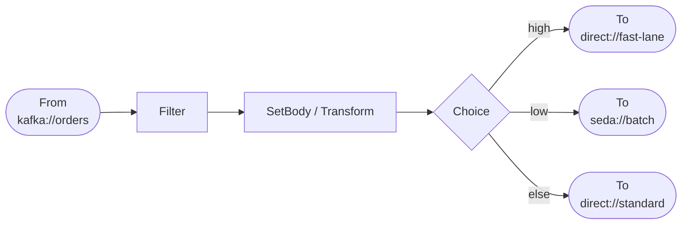
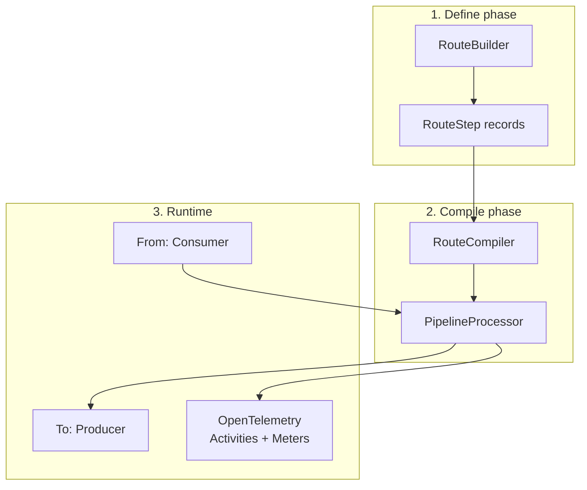
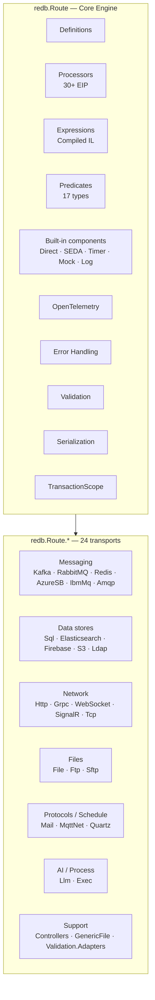
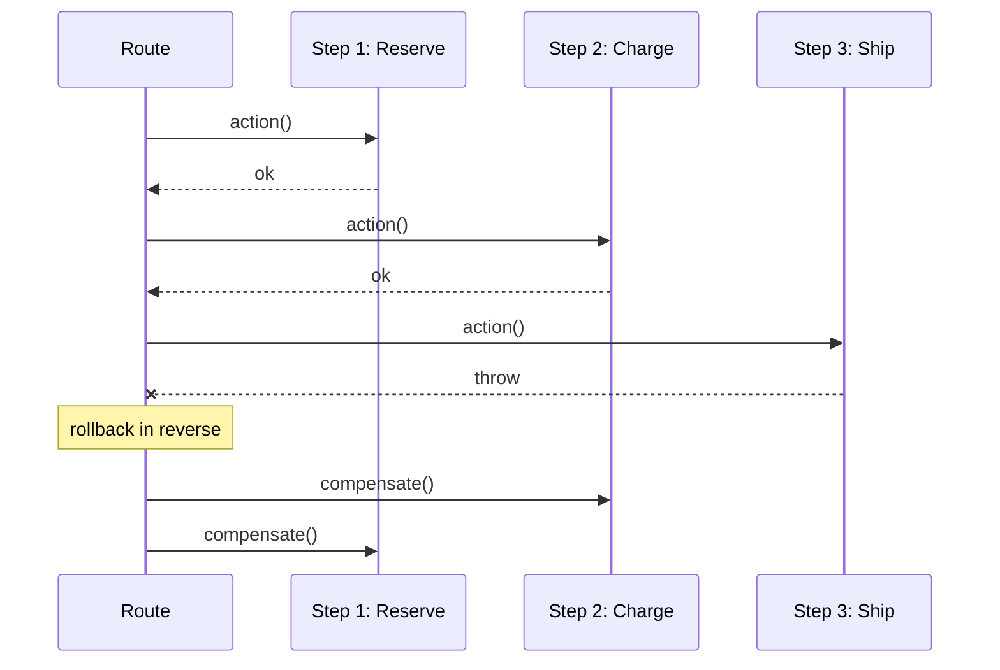
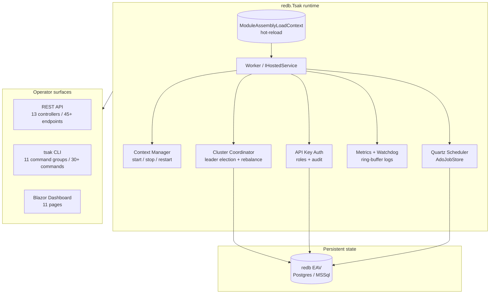
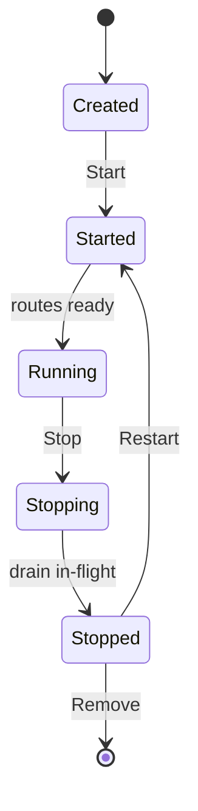

# redb.Route

**Enterprise integration framework for .NET. Wire any system to any system in a few lines of C#.**

> **LLMs / coding agents:** canonical training contract for the whole redb ecosystem → <https://redbase.app/llms.txt>

redb.Route is the .NET equivalent of [Apache Camel](https://camel.apache.org/) — a fluent C# DSL that connects Kafka, RabbitMQ, Redis, SQL, HTTP, gRPC, SFTP, MQTT, S3, and more through `From → Process → To` pipelines. No XML, no message-bus lock-in, no per-endpoint license fees.

[](https://www.nuget.org/packages/redb.Route)
[](LICENSE)
[](https://dotnet.microsoft.com)

> **Production runtime:** routes are packaged as `.tpkg` modules and deployed to **[redb.Tsak](https://github.com/redbase-app/redb-tsak)** — the runtime container with hot-reload, clustering, REST management API, CLI and Blazor dashboard. redb.Route handles the _what_ (pipeline logic); redb.Tsak handles the _where_, _when_ and _how many_ (deployment lifecycle). See [Running Routes in Production](#running-routes-in-production--redbtsak).

```csharp
From("kafka://orders?groupId=svc&brokers=localhost:9092")
    .Filter(Header("type").isEqualTo("new"))
    .Retry(3)
    .To("rabbitmq://events?host=localhost");
```

---

## Highlights

- **24 external transports + 5 built-in components** (Direct, SEDA, Timer, Mock, Log). The 24th — `llm:` — is a first-class LLM connector with a universal OpenAI-compatible provider (14 APIs) and a native Anthropic Messages API provider, plus `.AsLlmTool()` to expose any of the other 23 transports as an LLM-callable tool with zero connector changes. Token-by-token streaming runs end-to-end: `?stream=true` on an `llm://` step lands on the wire as Server-Sent Events through `redb.Route.Http` (with an `event: done` summary trailer) or as one `Text` frame per token through `redb.Route.WebSocket`.
- **30+ EIP patterns** — Splitter, Aggregator, CBR, WireTap, Saga, Circuit Breaker, Idempotent Consumer, Claim Check, Throttle, Resequencer, Scatter-Gather, and more.
- **Compiled expression engine** — `${header.x}`, `${header.x++}`, arithmetic, JSONPath, XPath compile to `Func<IExchange, T>` via `System.Linq.Expressions`. No interpreter overhead.
- **Type-safe fluent builders** — `Kafka.Topic("orders").GroupId("svc").Acks("All")` instead of URI strings.
- **OpenTelemetry built-in** — Activities and Meters per route and per step, no extra config.
- **Transactional routes** — `.Transacted()` wraps pipeline steps in `TransactionScope`; SQL transport binds ADO.NET transactions per statement.
- **Production runtime** — [redb.Tsak](#running-routes-in-production--redbtsak) hosts route assemblies with hot-reload, clustering, REST API and Web UI.
- **Apache 2.0 licensed** — no commercial restrictions, no per-endpoint pricing.

---

## Table of Contents

- [Quick Start](#quick-start)
- [Why redb.Route](#why-redbroute) — [Differentiators](#what-sets-redbroute-apart) · [vs other .NET options](#vs-other-net-options-quick-guide) · [Manual code comparison](#manual-code-comparison)
- [Use Cases](#use-cases)
- [Configuration](#configuration) — appsettings, IOptions, DI parameterization
- [How It Compares](#how-it-compares) — vs Apache Camel, MassTransit, NServiceBus, Wolverine; [Migrating from Camel](#migrating-from-apache-camel)
- [Routing Patterns](#routing-patterns) — From, To, Filter, Choice, Split, Recipient List, Dynamic Router
- [Error Handling](#error-handling) — [Retry](#retry-per-step) · [Dead Letter Channel](#dead-letter-channel) · [TryCatch](#trycatch-scoped) · [OnException scope](#onexception--scope-form-chain) · [OnException configure](#onexception--configure-form-action) · [Redelivery options](#redelivery-configuration) · [Combined example](#combined-example)
- [Message Transformation](#message-transformation) — SetBody, SetHeader, Marshal, Unmarshal
- [Expression Language](#expression-language) — helpers, predicates, string templates
- [Other EIP Patterns](#other-eip-patterns) — WireTap, Multicast, Throttle, Circuit Breaker, Saga, Idempotent Consumer, Loop, Delay, Resequencer, Enrich
- [Request-Response (InOut)](#request-response-inout)
- [Reliability](#reliability) — RabbitMQ confirms, Kafka EOS, persistent IdempotentConsumer, Outbox via Sql polling
- [Validation](#validation)
- [Testing with Mock](#testing-with-mock)
- [Telemetry](#telemetry)
- [Logging](#logging)
- [Fluent Transport Builders](#fluent-transport-builders)
- [Architecture](#architecture)
- [DSL Reference](#dsl-reference)
- [URI Scheme Reference](#uri-scheme-reference)
- [Transport Capability Matrix](#transport-capability-matrix)
- [Packages](#packages)
- [Running Routes in Production — redb.Tsak](#running-routes-in-production--redbtsak)
- [Contributing](#contributing)
- [License](#license)

---

## Quick Start

Every redb.Route pipeline follows the same shape: a single source (`From`), zero or more processors in the middle, and one or more sinks (`To`). Messages flow as `IExchange` instances carrying `Body`, `Headers`, and `Properties`.



```csharp
// Program.cs — minimal integration pipeline
var builder = Host.CreateApplicationBuilder(args);

builder.Services.AddRedbRoute(route =>
{
    route.AddRoutes(r =>
    {
        // Kafka → filter → RabbitMQ in 3 lines
        r.From("kafka://orders?groupId=svc&brokers=localhost:9092")
            .Filter(e => e.Message.GetHeader<string>("type") == "new")
            .To("rabbitmq://events?host=localhost");
    });
});
builder.Services.AddRedbRouteKafka();
builder.Services.AddRedbRouteRabbitMQ();

var app = builder.Build();
app.Run();
```

For complex routing logic, group routes into a `RouteBuilder` class:

```csharp
public class OrderRoutes : RouteBuilder
{
    protected override void Configure()
    {
        From("kafka://orders?groupId=svc&brokers=localhost:9092")
            .RouteId("order-pipeline")
            .Choice()
                .When(Header("priority").isEqualTo("high"))
                    .Log("High priority order")
                    .To("direct://fast-lane")
                .When(Header("priority").isEqualTo("low"))
                    .To("seda://batch-queue")
                .Otherwise()
                    .To("direct://standard")
            .EndChoice();

        From("direct://fast-lane")
            .Retry(3)
            .SetHeader("processed-at", e => DateTimeOffset.UtcNow)
            .Process(async (exchange, ct) =>
            {
                var body = exchange.Message.GetBody<string>();
                exchange.Message.SetBody($"PROCESSED: {body}");
            })
            .To("rabbitmq://processed?host=localhost");
    }
}

builder.Services.AddRedbRoute(route => route.AddRouteBuilder<OrderRoutes>());
```

---

## Why redb.Route

### What sets redb.Route apart

Four things you do not get together in any other .NET integration framework:

- **24 transports out of the box, including a full LLM connector.** Kafka, RabbitMQ, Redis, SQL, HTTP, gRPC, SFTP, MQTT, S3, IBM MQ, AMQP 1.0, Azure Service Bus, Elasticsearch, Firebase, LDAP, Mail, TCP, WebSocket, SignalR, FTP, Quartz, File, **Exec** (local-process execution), and **`llm:`** (OpenAI-compatible universal provider for 14 vendors + native Anthropic Messages API) — **plus `.AsLlmTool()` that turns any of the other 23 transports into an LLM tool with zero connector changes**. MassTransit ships 5, Wolverine 4, NServiceBus 7. The competitors expect you to use only message brokers; redb.Route treats files, mailboxes, FTP servers, SQL polling, local processes and LLM endpoints as first-class transports — and any of them can become an LLM-callable tool.
- **Compiled expression engine.** `${header.x}`, `${header.x++}`, arithmetic, JSONPath, XPath are translated to `Func<IExchange, T>` via `System.Linq.Expressions` at route-build time. No interpreter, no per-message parsing, results cached per route. Apache Camel's Simple Language is interpreted; MassTransit / Wolverine / NServiceBus have no expression engine at all.
- **30+ EIP patterns as first-class DSL.** Filter, Choice, Splitter, Aggregator, Multicast, WireTap, Recipient List, Dynamic Router, Resequencer, Scatter-Gather, Claim Check, Idempotent Consumer, Saga, Circuit Breaker, Throttle, Retry, Dead Letter, Loop, Delay, Debounce, Enrich, Timeout, TryCatch, Transacted, Process, Validate. The .NET competitors give you Saga + Request/Response + Outbox; everything else you write yourself.
- **Apache 2.0 licensed, no per-endpoint pricing.** NServiceBus is commercial after 2 endpoints. redb.Route is unrestricted for any use, any scale.

Plus: type-safe fluent builders (`Kafka.Topic(...).GroupId(...)` instead of URI strings), built-in OpenTelemetry per route and per step, transactional pipelines via `.Transacted()`, and a production runtime ([redb.Tsak](#running-routes-in-production--redbtsak)) with hot-reload and clustering.

### vs other .NET options — quick guide

| If you need | Pick |
|-------------|------|
| Routing across many transports (Kafka + SQL + SFTP + HTTP in one pipeline) | **redb.Route** |
| EIP patterns (Splitter, Aggregator, Content-Based Router, WireTap) | **redb.Route** |
| Protocol bridging (Kafka ↔ RabbitMQ, MQTT ↔ HTTP, FTP ↔ SQL) | **redb.Route** |
| Choreography saga with compensations (pipeline-level, no external state) | **redb.Route** (`.Saga(s => s.Step(...).Compensate(...))`) |
| Outbox via SQL polling (`SELECT … WHERE processed=0` → process → `UPDATE`) | **redb.Route** (`Sql.Poll(...)` + `.Transacted()`) |
| In-process dispatch to handler classes (`RedbController` behind `direct:`) | **redb.Route** + `redb.Route.Controllers` |
| Async in-process pub/sub with `RouteBuilder` consumer classes | **redb.Route** (`seda:` + `RouteBuilder`) |
| Durable orchestrated saga state machine persisted across process restarts | MassTransit / NServiceBus / Wolverine |
| Transactional pipeline (deferred broker commit/ack tied to route outcome) | **redb.Route** (`.Transacted()` + `ITransactedAction`: Kafka EOS, RabbitMQ tx, IBM MQ, AMQP) |
| Managed transactional outbox container (auto table + background retry daemon) | MassTransit / NServiceBus / Wolverine |

> redb.Route and MassTransit/NServiceBus solve different problems. redb.Route is a **pipeline and transport integration engine** (Apache Camel for .NET). MassTransit/NServiceBus are **message-bus frameworks** centered on consumer registration and managed saga state. You can use both together — redb.Route for cross-protocol routing and transformation, MassTransit for durable long-running workflows.

Full side-by-side tables: [How It Compares](#how-it-compares).

### Manual code comparison

| Problem | Manual code | redb.Route |
|---------|-------------|------------|
| Connect Kafka → RabbitMQ | 80+ lines: consumer, producer, serialization, error handling | `From("kafka://orders").To("rabbitmq://events")` |
| Content-based routing | Nested `if/switch`, custom dispatch tables | `.Choice().When(...).To(...).Otherwise().To(...)` |
| Retry + Dead Letter | Hand-rolled retry loops, DLQ logic | `.Retry(3).DeadLetterChannel("seda://failed")` |
| File polling → DB | `FileSystemWatcher` + ADO.NET + threading | `From("file:///data?include=*.csv").To("sql://...")` |
| Observability | Custom metrics, `Activity` spans, logging | Built-in OpenTelemetry — traces and metrics per route/step |
| Protocol bridging | Custom adapter per protocol pair | Any-to-any via URI schemes: `kafka:`, `http:`, `grpc:`, `mqtt:` |

---

## Use Cases

redb.Route fits any workload where messages move between systems and need transformation, routing, or buffering on the way:

- **Message broker bridging.** Kafka topic → filter → enrich → RabbitMQ exchange. MQTT sensor stream → batch → SQL inserts.
- **File ingestion pipelines.** SFTP folder polling → unmarshal CSV → validate → SQL upsert → archive to S3.
- **API gateways and webhooks.** HTTP endpoint (`Http.Listen`) → validate → fan-out to internal queues → respond. Stripe/GitHub webhooks → SignalR broadcast.
- **Scheduled jobs.** Quartz Cron → SQL extract → email report. Timer → poll external API → push to Kafka.
- **Protocol translation.** SOAP → JSON, XML → CSV, gRPC → REST, MQTT → AMQP. Any-to-any via marshal/unmarshal + URI swap.
- **Saga orchestration without a state-machine framework.** Reserve inventory → charge payment → ship — with compensating steps on failure.
- **Event-driven microservices.** Per-service `RouteBuilder` classes register routes; `IHostedService` boots them; OpenTelemetry traces span the whole chain.
- **Legacy integration.** IBM MQ, FTP, LDAP, POP3/IMAP, raw TCP — first-class support, not afterthoughts.
- **Real-time dashboards.** Kafka stream → throttle → SignalR Hub → Blazor/JS clients.

If the question is *"how do I move messages from A to B with rules in the middle?"*, redb.Route answers it in a few lines of C#.

---

## Configuration

Endpoints, transports, and options work with the standard .NET configuration stack — `appsettings.json`, `IOptions<T>`, environment variables, secrets — without a custom config layer.

### Endpoint URIs from configuration

Resolve broker URLs, topic names, and credentials at startup, then build endpoint URIs in code:

```jsonc
// appsettings.json
{
  "Kafka": {
    "Brokers":  "broker1:9092,broker2:9092",
    "GroupId":  "order-svc",
    "Topic":    "orders"
  },
  "RabbitMQ": {
    "Host":     "rabbit.local",
    "Exchange": "events"
  }
}
```

```csharp
builder.Services.AddRedbRoute(route =>
{
    route.AddRoutes(r =>
    {
        var cfg   = builder.Configuration;
        var kafka = Kafka.Topic(cfg["Kafka:Topic"]!)
                         .Brokers(cfg["Kafka:Brokers"]!)
                         .GroupId(cfg["Kafka:GroupId"]!);
        var rabbit = Rabbit.Queue("events")
                           .Host(cfg["RabbitMQ:Host"]!)
                           .Exchange(cfg["RabbitMQ:Exchange"]!, "topic");

        r.From(kafka).To(rabbit);
    });
});
```

### Bind options into a RouteBuilder

Typed `IOptions<T>` flows through DI like any service. Inject into `RouteBuilder` constructors and use the values inside `Configure()`:

```csharp
public class KafkaOptions
{
    public string Brokers { get; set; } = "";
    public string GroupId { get; set; } = "";
    public string Topic   { get; set; } = "";
}

public class OrderRoutes : RouteBuilder
{
    private readonly KafkaOptions _kafka;

    public OrderRoutes(IOptions<KafkaOptions> kafka) => _kafka = kafka.Value;

    protected override void Configure()
    {
        From(Kafka.Topic(_kafka.Topic).Brokers(_kafka.Brokers).GroupId(_kafka.GroupId))
            .RouteId("order-pipeline")
            .To("seda://orders-internal");
    }
}

// Program.cs
builder.Services.Configure<KafkaOptions>(builder.Configuration.GetSection("Kafka"));
builder.Services.AddRedbRoute(route => route.AddRouteBuilder<OrderRoutes>());
```

### Named SQL data sources

The SQL transport uses **named** data sources registered in DI, so connection strings stay in configuration and out of route code:

```csharp
builder.Services.AddRedbRouteSql(sql =>
{
    sql.AddDataSource("main",   builder.Configuration.GetConnectionString("Main")!,    "SqlServer");
    sql.AddDataSource("audit",  builder.Configuration.GetConnectionString("Audit")!,   "PostgreSql");
});

// Routes reference the data source by name — credentials never appear in the URI
From(Sql.Poll("SELECT * FROM Orders WHERE Status = 'New'")
        .DataSource("main")
        .Delay(5000))
    .To(Sql.Execute("INSERT INTO AuditLog (Body) VALUES (@body)")
           .DataSource("audit")
           .Transacted());
```

### Engine options

```csharp
builder.Services.Configure<RouteEngineOptions>(o =>
{
    o.EnableTelemetry      = true;   // OpenTelemetry Activities
    o.EnableMetrics        = true;   // OpenTelemetry Meters
    o.DefaultRetryAttempts = 3;
    o.DefaultErrorMode     = ErrorMode.DeadLetter;
});
```

---

## How It Compares

### Summary

| | Apache Camel | MassTransit | NServiceBus | Wolverine | **redb.Route** |
|--|--|--|--|--|--|
| Platform | JVM | .NET | .NET | .NET | **.NET 8/9/10** |
| License | Apache 2.0 | Apache 2.0 | **Commercial** | MIT | **Apache 2.0** |
| Focus | EIP routing | Pub/sub + message bus | Message bus | Mediator + message bus | **Enterprise Service Bus (.NET)** |
| Transports | 300+ | 5 | 7 | 4 | **23 + 5 built-in + LLM** |
| EIP patterns | 80+ | Saga, R/R, Outbox | Saga, R/R | Saga, R/R, Outbox | **30+** |
| Expression engine | Simple Language (interpreted) | None | None | None | **Compiled (Linq.Expressions)** |
| Configuration | XML or Java DSL | C# fluent | C# fluent | C# fluent | **C# fluent only** |
| Saga persistence | Yes | **Yes (DB-backed)** | **Yes (DB-backed)** | **Yes (Marten)** | Compensating steps + persistent `IdempotentConsumer` (redb-EAV / SQL) for dedup; no built-in state machine |
| Outbox | Plugin | **Yes** | **Yes** | **Yes** | Polling outbox via `Sql.Poll(...).OnSuccess(...).Transacted()` + persistent `IdempotentConsumer` |
| Publisher confirms / EOS | Yes | Yes | Yes | Yes | **Yes** — RabbitMQ publisher confirms (`MaxOutstandingConfirms`), Kafka transactional producer + `Acks=All` |

### vs Apache Camel

If you know Camel, you know redb.Route — same EIP patterns, same `from → process → to` model, same URI endpoint scheme.

| Concept | Apache Camel (Java) | redb.Route (.NET) |
|---------|--------------------|-----------------|
| Route definition | `from().process().to()` | `From().Process().To()` |
| Route class | `RouteBuilder.configure()` | `RouteBuilder.Configure()` |
| In-process sync | `direct:` | `direct:` |
| In-memory async queue | `seda:` | `seda:` |
| Periodic trigger | `timer:` | `timer:` |
| Message object | `Exchange` + `Message` | `IExchange` + `IMessage` |
| Expression language | Simple Language (interpreted) | StringExpression (compiled) |
| EIP patterns | 80+ | 30+ (Filter, Choice, Splitter, Aggregator, Multicast, WireTap, Recipient List, Dynamic Router, Resequencer, Scatter-Gather, Claim Check, Idempotent Consumer, Saga, Circuit Breaker, Throttle, Retry, Dead Letter, Loop, Delay, Debounce, Enrich, Timeout, TryCatch, Transacted, …) |
| Components | 300+ | 24 transports + 5 built-in |
| Configuration | XML DSL or Java DSL | C# fluent DSL only |
| Runtime / orchestration | Camel K / JBoss Fuse | [redb.Tsak](#running-routes-in-production--redbtsak) |
| Platform | JVM | .NET 8 / 9 / 10 |

What redb.Route does differently from Camel:

- **No XML.** C# fluent DSL with full IntelliSense.
- **Type-safe builders.** `Kafka.Topic("orders").GroupId("svc")` instead of URI strings.
- **Native .NET stack.** `IHostedService`, `IServiceCollection`, `ILogger`, `CancellationToken` everywhere.
- **OpenTelemetry built in.** Traces and metrics per route and per step.
- **Compiled expressions.** `${header.x++}`, arithmetic, JSONPath, XPath compile to `Func<IExchange, T>` — not interpreted.
- **Transactional routes.** `.Transacted()` via `TransactionScope`.
- **.NET-specific transports.** SignalR, ASP.NET Kestrel server-side consumers.

#### Migrating from Apache Camel

Camel routes translate to redb.Route almost line for line. Method names use PascalCase, predicates are typed, but the structure is identical.

| Apache Camel (Java) | redb.Route (C#) |
|---------------------|-----------------|
| `from("kafka:orders?brokers=...")` | `From("kafka://orders?brokers=...")` |
| `.routeId("order-pipeline")` | `.RouteId("order-pipeline")` |
| `.choice()` | `.Choice()` |
| `.when(header("type").isEqualTo("new"))` | `.When(Header("type").isEqualTo("new"))` |
| `.otherwise()` | `.Otherwise()` |
| `.end()` | `.EndChoice()` |
| `.split(body())` | `.Split(Body())` |
| `.aggregate(header("orderId"), strategy)` | `.Aggregate(Header("orderId"), strategy)` |
| `.wireTap("seda:audit")` | `.WireTap("seda://audit")` |
| `.recipientList(header("dest"))` | `.RecipientList(e => ParseDest(e))` |
| `.errorHandler(deadLetterChannel("seda:dlq"))` | `.DeadLetterChannel("seda://dlq")` |
| `.onException(IOException.class).maximumRedeliveries(3)` | `OnException<IOException>().MaximumRedeliveries(3)` |
| `.transacted()` | `.Transacted()` |
| `.setBody(simple("${header.x}"))` | `.SetBody(Expr("${header.x}"))` |
| `.log("got ${body}")` | `.Log("got ${body}")` |
| `.to("rabbitmq://events")` | `.To("rabbitmq://events")` |

A 200-line Camel `RouteBuilder.configure()` typically becomes a 200-line C# `RouteBuilder.Configure()` with the same shape — only the host (Spring Boot vs `IHost`) and the build system change.

### vs MassTransit

| Aspect | MassTransit | redb.Route |
|--------|-------------|------------|
| Focus | Reliable message bus + Saga | Enterprise Service Bus — 24 transports, 30+ EIP (Enterprise Integration Patterns), transactional pipelines |
| Routing model | Consumer classes | Route pipelines (`From → Process → To`) |
| EIP patterns | Saga, Request/Response, Outbox | 30+ EIP patterns |
| Transports | 5 (RabbitMQ, Kafka, SQS, Azure SB, gRPC) | 22 (+ File, SFTP, SQL, MQTT, TCP, HTTP, FTP, LDAP, IBM MQ, S3, …) |
| Saga | State machine + **persistent state** (DB-backed) | Compensating steps (forward + reverse) with persistent dedup via `IdempotentConsumer` (redb-EAV / SQL backends, two-phase commit) — no built-in state machine |
| Outbox | Yes (transactional outbox pattern) | Polling outbox via `Sql.Poll(...).OnSuccess(...).Transacted()` + persistent `IdempotentConsumer` (de-facto outbox) |
| Publisher reliability | Yes (RabbitMQ confirms, Kafka EOS) | **Yes** — RabbitMQ publisher confirms, mandatory flag, transacted channels, automatic recovery; Kafka transactional producer + `Acks=All` + `IsolationLevel=ReadCommitted` |
| Expressions | None | Compiled engine: 9 types, 17 predicates, `${header.x++}`, arithmetic |
| Transactional routes | No | Yes — `.Transacted()` via `TransactionScope` |
| License | Apache 2.0 | Apache 2.0 |

Use MassTransit for **state-machine sagas with DB persistence** and a built-in transactional outbox table per consumer. Use redb.Route for enterprise integration end-to-end: 30+ EIP patterns, 24 transports, transactional pipelines (`ITransactedAction`), protocol bridging, file processing, and multi-transport pipelines — reliability primitives (publisher confirms, EOS, persistent dedup, polling outbox) composed from DSL building blocks.

### vs NServiceBus

| Aspect | NServiceBus | redb.Route |
|--------|-------------|------------|
| Focus | Message bus (reliable delivery + Saga) | Enterprise Service Bus — 24 transports, 30+ EIP (Enterprise Integration Patterns), transactional pipelines |
| Routing model | Message handler classes | Route pipelines |
| EIP patterns | Saga (persistent), Request/Response | 30+ EIP patterns |
| Transports | 7 (RabbitMQ, Kafka, SQS, Azure SB, SQL, MSMQ, Learning) | 22 (+ File, SFTP, MQTT, TCP, HTTP, gRPC, FTP, LDAP, IBM MQ, S3, …) |
| Expressions | None | Compiled expression engine |
| Transactional routes | No | Yes — `.Transacted()` via `TransactionScope` |
| Monitoring | ServicePulse / ServiceInsight (commercial) | OpenTelemetry + redb.Tsak Web UI |
| License | **Commercial** (free up to 2 endpoints/app) | Apache 2.0 |

NServiceBus is mature and focused on guaranteed delivery and durable saga. redb.Route is Apache-2.0–licensed and covers enterprise integration end-to-end: 30+ EIP patterns, 24 transports, transactional pipelines (`ITransactedAction`), and a full runtime (redb.Tsak) with clustering, hot-reload, and OTel.

### vs Wolverine

| Aspect | Wolverine | redb.Route |
|--------|-----------|------------|
| Focus | Mediator + message bus + Saga | Enterprise Service Bus — 24 transports, 30+ EIP (Enterprise Integration Patterns), transactional pipelines |
| Routing model | Handler discovery + middleware | Route pipelines (`From → Process → To`) |
| EIP patterns | Saga, Outbox, Request/Response | 30+ EIP patterns |
| Transports | 4 (RabbitMQ, Kafka, Azure SB, SQS) | 22 (+ File, SFTP, SQL, MQTT, HTTP, gRPC, FTP, LDAP, IBM MQ, S3, …) |
| Saga storage | Marten / EF Core | In-memory compensating steps |
| Expressions | None | Compiled expression engine |
| Transactional routes | Outbox-based | `.Transacted()` via `TransactionScope` |
| License | MIT | Apache 2.0 |

Wolverine is excellent at handler-style messaging with Marten-backed sagas. redb.Route covers enterprise integration end-to-end: 30+ EIP patterns, 24 transports, in-process mediator (`RedbController`), pub/sub (SEDA), transactional pipelines, and a full production runtime (redb.Tsak).

---

## Routing Patterns

```csharp
// Content-Based Router
.Choice()
    .When(Header("type").isEqualTo("order")).To("direct://orders")
    .When(Header("type").isEqualTo("payment")).To("direct://payments")
    .Otherwise().To("seda://unknown")
.EndChoice()

// Recipient List — send to multiple dynamic destinations
.RecipientList(e => new[] { "direct://audit", "seda://analytics" })

// Dynamic Router — destination computed at runtime
.DynamicRouter(e => ComputeNextEndpoint(e))

// Splitter — sub-route style
.Split(e => SplitOrderIntoItems(e),
       sub => sub.Process(async (e, ct) => await ProcessItem(e, ct)))

// Splitter — scope style
.Split(e => SplitOrderIntoItems(e))
    .Process(async (e, ct) => await ProcessItem(e, ct))
.EndSplit()
```

`When(...)` accepts three forms — lambda, `IPredicate`, or string expression:

```csharp
.When(e => e.Message.GetHeader<string>("type") == "order")    // lambda
.When(Header("type").isEqualTo("order"))                      // IPredicate
.When("header.type == 'order'")                               // string expression
```

---

## Error Handling

redb.Route has four layers of error handling, designed to be combined: per-step `Retry`, scoped `DoTry/DoCatch`, route-local `OnException`, and global `OnException` declared in `RouteBuilder`. A `DeadLetterChannel` can route failed messages to any URI when retries are exhausted.

### Retry (per step)

Local retry around a single processing step. Useful when an external call may fail transiently.

```csharp
.Retry(maxRetries: 5, initialDelay: TimeSpan.FromSeconds(1))
.To("http://flaky-service/submit")
```

### Dead Letter Channel

Routes the failing exchange to a sink endpoint after retries are exhausted. The exception is preserved on the exchange (`exchange.GetException()`) and accessible from the dead-letter sub-route.

```csharp
// Route-level: any unhandled failure goes to seda://dlq
From("kafka://orders")
    .DeadLetterChannel("seda://dlq")
    .Process(...)
    .To("sql://orders");

// The DLQ route inspects the exception and decides what to do
From("seda://dlq")
    .Log("DLQ: ${header.JMSCorrelationID} — ${exception.message}")
    .Choice()
        .When(e => e.GetException() is TimeoutException).To("seda://retry-later")
        .Otherwise().To("sftp://archive/failed/")
    .EndChoice();
```

### TryCatch (scoped)

A `try/catch/finally` block inside a route. Choose this when only a specific section of the pipeline needs special handling.

```csharp
.DoTry()
    .To("http://external-api/submit")
    .Process(async (e, ct) => await PostProcess(e, ct))
.DoCatch<HttpRequestException>()
    .Log("HTTP failure: ${exception.message}")
    .To("seda://retry-queue")
.DoCatch<TimeoutException>()
    .Log("Timeout, archiving")
    .To("sftp://archive/timeouts/")
.DoFinally()
    .Log("Attempt complete (success or failure)")
.End()
```

### OnException — scope form (chain)

Defines a handler for a specific exception type with full redelivery configuration. Two placement options:

**Inside a route** — handler applies only to that single route:

```csharp
From("kafka://orders")
    .OnException<TimeoutException>()
        .MaximumRedeliveries(3)
        .RedeliveryDelay(TimeSpan.FromSeconds(1))
        .UseExponentialBackOff()
        .BackOffMultiplier(2.0)
        .Handled()                        // mark exception as handled, exchange continues
        .To("seda://timeout-handler")
    .EndOnException()
    .Process(...)
    .To("rabbitmq://processed");
```

**At RouteBuilder level** — global, applies to every route in the builder:

```csharp
public class OrderRoutes : RouteBuilder
{
    protected override void Configure()
    {
        // Global handlers — apply to all From(...) routes below
        OnException<HttpRequestException>()
            .MaximumRedeliveries(5)
            .UseExponentialBackOff()
            .Handled()
            .To("seda://http-failures")
        .EndOnException();

        OnException<DbException>()
            .MaximumRedeliveries(2)
            .UseOriginalMessage()         // restore original body before sending to handler
            .To("seda://db-failures")
        .EndOnException();

        // Multiple exception types in one block
        OnException(typeof(TimeoutException), typeof(SocketException))
            .MaximumRedeliveries(3)
            .To("seda://network-failures")
        .EndOnException();

        From("kafka://orders")
            .To("http://payments-svc/charge");

        From("kafka://shipments")
            .To("http://logistics-svc/dispatch");
    }
}
```

### OnException — configure form (action)

For multiple handlers in one block. Each `Handle<T>` accepts a sub-route and per-exception redelivery options.

```csharp
.OnException(cfg => cfg
    .Handle<TimeoutException>(
        handler:        h => h.Log("Timeout, retry").To("seda://retry"),
        maxRedeliveries: 3,
        redeliveryDelay: TimeSpan.FromSeconds(2),
        useExponentialBackoff: true)
    .Handle<HttpRequestException>(
        handler:        h => h.To("seda://http-fail"),
        maxRedeliveries: 5)
    .Handle<DbException>(
        handler:        h => h.To("seda://db-fail")));
```

### Redelivery configuration

All modifiers below are valid inside an `OnException(...).EndOnException()` scope:

| Method | Purpose |
|--------|---------|
| `MaximumRedeliveries(n)` | Max retry attempts before handler fires |
| `RedeliveryDelay(TimeSpan)` | Base delay between attempts |
| `BackOffMultiplier(d)` | Multiplier applied to delay between attempts |
| `UseExponentialBackOff()` | Switch from fixed to exponential backoff |
| `Handled()` / `Handled(false)` | Mark exception as handled (exchange continues normally) |
| `Continued()` | Continue routing the *original* exchange after handler |
| `OnWhen(predicate)` | Only fire the handler when predicate matches |
| `RetryWhile(predicate)` | Continue retrying only while predicate is true |
| `UseOriginalMessage()` | Restore the original message (before processing) for the handler |
| `UseOriginalBody()` | Restore only the original body |
| `OnRedelivery(action)` | Callback fired before each retry attempt |
| `OnPrepareFailure(action)` | Callback fired before invoking the handler |
| `OnExceptionOccurred(action)` | Callback fired the moment exception is caught |
| `RetryAttemptedLogLevel(level)` | Log level for retry attempt messages |
| `RetriesExhaustedLogLevel(level)` | Log level for retries-exhausted message |
| `LogStackTrace(bool)` | Whether to log full stack trace |
| `LogExhausted(bool)` | Whether to log when retries are exhausted |
| `RedeliveryPolicy(policy)` | Apply a pre-built `RedeliveryPolicy` instance |

### Combined example

Global policy + route-local override + DLC + per-step retry, all together:

```csharp
public class PaymentRoutes : RouteBuilder
{
    protected override void Configure()
    {
        // 1. Global policy — transient HTTP errors retry 5x with exponential backoff
        OnException<HttpRequestException>()
            .MaximumRedeliveries(5)
            .RedeliveryDelay(TimeSpan.FromSeconds(1))
            .UseExponentialBackOff()
            .BackOffMultiplier(2.0)
            .RetryAttemptedLogLevel(LogLevel.Warning)
            .OnRedelivery(e => Metrics.Inc("redelivery", 1))
            .Handled()
            .To("seda://transient-failures")
        .EndOnException();

        From("kafka://payments?groupId=svc")
            .RouteId("payment-pipeline")
            // 2. Route-level DLC — anything that bubbles past handlers ends up here
            .DeadLetterChannel("seda://payments-dlq")

            // 3. Route-local override — timeout policy specific to this route
            .OnException<TimeoutException>()
                .MaximumRedeliveries(2)
                .UseOriginalMessage()
                .To("seda://payment-timeouts")
            .EndOnException()

            .Validate(e => e.Message.GetBody<Payment>().Amount > 0)
            .Process(async (e, ct) => await EnrichWithCustomer(e, ct))

            // 4. Per-step retry — no policy needed, just "try again"
            .Retry(maxRetries: 3, initialDelay: TimeSpan.FromMilliseconds(500))
            .To("http://payments-gateway/charge");

        From("seda://payments-dlq")
            .Log("Payment DLQ — ${exception.message}")
            .To("sftp://archive/payments/failed/");
    }
}
```

Resolution order when multiple matches exist: route-local `OnException` → RouteBuilder global `OnException` → `DeadLetterChannel` → unhandled (logged and propagated). The most specific exception type wins within each level.

---

## Message Transformation

```csharp
// Set body — static, lambda, or expression
.SetBody("static value")
.SetBody(e => TransformPayload(e.Message.GetBody<Order>()))
.SetBody(JPath("$.order.items"))
.SetBody(Expr("${header.orderId}-${body}"))

// Transform body
.Transform(e => JsonSerializer.Serialize(e.Message.GetBody<object>()))
.Transform(JPath<string>("$.order.summary"))

// Headers
.SetHeader("source", "order-service")
.SetHeader("source", e => e.Message.GetHeader<string>("origin") ?? "unknown")
.SetHeader("total", JPath<decimal>("$.order.total"))
.RemoveHeader("internal-trace-id")

// Exchange properties
.SetProperty("retryCount", 0)
.SetProperty("startedAt", e => DateTimeOffset.UtcNow)
.RemoveProperty("temp-flag")

// Marshal / Unmarshal
.Marshal(typeof(JsonMessageSerializer))
.Unmarshal(typeof(XmlMessageSerializer), typeof(Order))
```

---

## Expression Language

redb.Route has a compiled expression engine. Templates and predicates compile to `Func<IExchange, T>` via `System.Linq.Expressions` — no interpreter overhead, results cached per route.

### Helpers

All helpers are `protected static` methods on `RouteBuilder` — use them directly inside `Configure()`:

```csharp
// Message accessors
Body()                          // read message body
Header("name")                  // read header value
Property("key")                 // read exchange property
Constant(42)                    // constant value
Exchange(e => e.RouteId)        // delegate over IExchange

// Structured data
JPath("$.order.total")          // JSONPath expression
JPath<decimal>("$.order.total") // typed JSONPath
XPath("/order/status/text()")   // XPath expression
XPath<string>("/order/status")  // typed XPath

// String templates (StringExpression — bridges ${...} to IExpression)
Expr("${header.orderId}")               // single header interpolation
Expr("${header.prefix}-${body}")        // multi-value template
Expr("header.amount")                   // raw value expression (no ${})
```

### Predicates

Every expression supports 17 predicate methods returning `IPredicate` for use in `Filter()`, `When()`, `Validate()`:

```csharp
// Comparison
Header("status").isEqualTo("active")
Header("status").isNotEqualTo("cancelled")
Header("amount").isGreaterThan(1000)
Header("amount").isLessThan(500)
Header("amount").isGreaterThanOrEqualTo(100)
Header("amount").isLessThanOrEqualTo(9999)
Header("amount").isBetween(100, 5000)

// String
Header("name").contains("Corp")
Header("name").startsWith("Order-")
Header("name").endsWith(".pdf")
Header("email").regex(@"^[\w.]+@[\w.]+\.\w+$")

// Collection
Header("type").In("order", "payment", "refund")

// Null
Header("optional").isNull()
Header("required").isNotNull()
```

### String Expressions

`Expr()` creates a `StringExpression` that auto-detects `${...}` templates vs raw value expressions. Beyond plain interpolation, the engine supports arithmetic, increment/decrement, and comparison operators that compile to expression trees:

```csharp
// Template mode — ${...} placeholders interpolated at runtime
.SetBody(Expr("${header.orderId}-${body}"))
.SetHeader("trace", Expr("${header.source}-${header.correlationId}"))

// Increment / decrement (mutates the underlying header/property)
.SetHeader("attempt", Expr("${header.attempt++}"))   // post-increment, returns old value
.SetHeader("attempt", Expr("${++header.attempt}"))   // pre-increment, returns new value

// Arithmetic
.SetHeader("total", Expr("${header.qty * header.price}"))
.SetHeader("net",   Expr("${header.gross - header.tax}"))

// Value mode — evaluated as expression, result is object
.Filter(Expr("header.amount").isGreaterThan(1000))
.SetBody(Expr("header.total"))

// String expressions in Filter/When (shorthand, no Expr needed)
.Filter("header.priority == 'high'")
.When("header.amount > 1000")
```

---

## Other EIP Patterns

```csharp
// Wire Tap — send copy to audit without affecting main flow
.WireTap("seda://audit")

// Multicast — send to multiple endpoints in parallel
.Multicast("direct://service-a", "direct://service-b")

// Throttle — rate limiting
.Throttle(100)                              // max 100 messages/second
.Throttle(500, TimeSpan.FromMinutes(1))     // max 500 per minute

// Circuit Breaker
.CircuitBreaker(cb => cb
    .Threshold(5)
    .ResetTimeout(TimeSpan.FromSeconds(30)))

// Idempotent Consumer — deduplicate (works as outbox-style dedup with persistent backend)
.IdempotentConsumer(e => e.Message.GetHeader<string>("messageId"), repository)
//   InMemoryIdempotentRepository       — process-local, default
//   SqlIdempotentRepository            — ADO.NET, two-phase commit, survives restarts
//   RedbIdempotentRepository           — redb.Core EAV, two-phase commit, cluster-wide

// Loop — fixed count or conditional
.Loop(3, sub => sub.Process(e => Retry(e)))
.Loop(e => !e.Message.GetHeader<bool>("done"), sub => sub.Process(e => DoWork(e)))

// Delay
.Delay(TimeSpan.FromSeconds(5))
.Delay(e => TimeSpan.FromSeconds(e.Message.GetHeader<int>("backoff")))

// Resequencer — reorder messages
.Resequence(e => e.Message.GetHeader<long>("sequenceNumber"))

// Enrich — content enricher
.Enrich("http://api/details", (original, enrichment) => Merge(original, enrichment))

// Saga — compensating steps
.Saga(s => s
    .Step(
        action:     async (e, ct) => await ReserveInventory(e, ct),
        compensate: async (e, ct) => await ReleaseInventory(e, ct))
    .Step(
        action:     async (e, ct) => await ChargePayment(e, ct),
        compensate: async (e, ct) => await RefundPayment(e, ct))
    .OnCompletion(async (e, ct) => await PublishOrderCompleted(e, ct)))

// Transacted — wrap pipeline step in TransactionScope
.Transacted()

// Process — inline async with CancellationToken
.Process(async (exchange, ct) =>
{
    var order = exchange.Message.GetBody<Order>();
    var result = await ProcessOrder(order, ct);
    exchange.Message.SetBody(result);
})
```

---

## Request-Response (InOut)

For synchronous request-response over HTTP/gRPC/WebSocket, mark the listener as `InOut()` and finish the route with `.Respond()`:

```csharp
public class OrderApi : RouteBuilder
{
    protected override void Configure()
    {
        From(Http.Listen("/api/orders").Port(8080).InOut())
            .Unmarshal(typeof(JsonMessageSerializer), typeof(CreateOrderRequest))
            .Process(async (e, ct) =>
            {
                var req  = e.Message.GetBody<CreateOrderRequest>();
                var resp = await orderService.CreateAsync(req, ct);
                e.Message.SetBody(resp);
            })
            .Marshal(typeof(JsonMessageSerializer))
            .Respond();   // returns the body to the HTTP client
    }
}
```

The same pattern works for `Grpc.Listen(...)` and `Ws.Listen(...)`.

---

## Reliability

redb.Route provides four primitives for at-least-once and exactly-once delivery. They compose: enable confirms on the producer, persistent dedup on the consumer, polling outbox in your service \u2014 you have the same guarantees that frameworks bundle as `UseOutbox()`, just spelled out.

### RabbitMQ Publisher Confirms + Deferred Consumer Ack

The RabbitMQ producer uses publisher confirms by default with broker-side flow control:

```csharp
.To(Rabbit.Queue("orders")
    .Host("rabbit.local")
    .MaxOutstandingConfirms(2048)        // in-flight publishes throttled by ThrottlingRateLimiter
    .Mandatory(true)                     // unroutable messages surface as exceptions (BasicReturn)
    .Transacted(false)                   // or use AMQP transactions instead of confirms
    .AutomaticRecovery(true)             // reconnect + re-declare topology on broker restart
    .TopologyRecoveryEnabled(true))
```

Every `BasicPublishAsync` call awaits broker confirmation; producer back-pressure kicks in when `MaxOutstandingConfirms` is reached. `Mandatory(true)` surfaces `BasicReturn` events as exchange exceptions — routing failures fail loudly.

### Deferred Ack — `ITransactedAction` (RabbitMQ, AMQP, IBM MQ, Kafka)

The deferred ack pattern is implemented uniformly across all four brokers. When `.Transacted()` is active, neither the consumer ack nor the producer send fire immediately. Both are registered as `ITransactedAction` instances on the exchange (`exchange.Properties["TRANSACT_ACTION"]`) and execute together when the `TransactionScope` closes.

| Transport | Commit | Rollback |
|-----------|--------|----------|
| **RabbitMQ** consumer | `TxCommit` + `BasicAck(deliveryTag)` | `TxRollback` + `BasicNack(requeue=true)` |
| **RabbitMQ** producer | `BasicPublishAsync` fires | message dropped |
| **AMQP 1.0** consumer | `receiver.Accept(msg)` | `receiver.Release(msg)` |
| **AMQP 1.0** producer | `sender.Send(msg)` fires | message dropped |
| **IBM MQ** consumer | `QueueManager.Commit()` (MQCMIT) | `QueueManager.Backout()` (MQBACK) |
| **IBM MQ** producer | MQPUT + MQCMIT | message dropped |
| **Kafka** consumer | `consumer.Commit(result)` — offset committed | offset not committed (message will be re-delivered) |
| **Kafka** producer | `ProduceAsync` fires (inside Kafka transaction if EOS enabled) | message dropped |

All actions for one exchange share the same `ConcurrentDictionary<string, ITransactedAction>` — consumer ack and producer send commit or roll back atomically. IBM MQ additionally tracks `BackoutCount`; if it reaches `BackoutThreshold`, the message moves to a backout queue instead of rolling back into the main queue indefinitely (poison message handling).

```csharp
// Same .Transacted() syntax regardless of broker
From(Rabbit.Queue("orders").Transacted(true))
    .Transacted()
    .Process(async (e, ct) => await SaveToDb(e, ct))
    .To(Rabbit.Queue("processed").Transacted(true));
// Commit: BasicAck(orders) + BasicPublish(processed) — atomic
// Rollback: BasicNack(orders, requeue=true) + send dropped

From("wmq://ORDERS.IN?transacted=true")
    .Transacted()
    .Process(async (e, ct) => await SaveToDb(e, ct))
    .To("wmq://ORDERS.OUT?transacted=true");
// Commit: MQCMIT on both consumer and producer
// Rollback: MQBACK — message back in ORDERS.IN

From(Kafka.Topic("payments").GroupId("svc"))
    .Transacted()
    .Process(async (e, ct) => await SaveToDb(e, ct))
    .To(Kafka.Topic("processed").EnableTransactionalProducer(true).Acks("All"));
// Commit: offset committed + produce inside Kafka transaction
// Rollback: offset not committed — message re-delivered on next poll
```

### Kafka Exactly-Once Semantics (EOS)

```csharp
.To(Kafka.Topic(\"orders\")
    .Brokers(\"broker1:9092,broker2:9092\")
    .Acks(\"All\")                          // wait for all in-sync replicas
    .EnableTransactionalProducer(true)    // transactional.id assigned per producer
    .TransactionIdPrefix(\"order-svc\")
    .EnableIdempotence(true))
```

Consumer side pairs with `IsolationLevel=ReadCommitted` and manual commits to read only committed messages. The transport supports the full Confluent.Kafka transactional API.

### Persistent Idempotent Consumer (de-facto outbox for dedup)

`IdempotentConsumer` rejects duplicate messages by key. With a persistent backend it survives restarts and crashes \u2014 the same role an Outbox `processed_messages` table plays in MassTransit / NServiceBus.

Three backends ship today:

| Backend | Storage | Two-phase commit |
|---------|---------|:--:|
| `InMemoryIdempotentRepository` | Process memory | \u2014 |
| `SqlIdempotentRepository` | ADO.NET (any provider) \u2014 DDL ships with the package | \u2705 (`Confirmed` column) |
| `RedbIdempotentRepository` | redb.Core EAV (cluster-wide via redb backend) | \u2705 (`Confirmed` flag) |

Two-phase commit means the key is **claimed** before processing and **confirmed** after. A crash mid-processing leaves the key unconfirmed; on retry the consumer re-acquires and re-processes. Same semantic as a transactional outbox.

```csharp
// Register persistent backend in DI\nbuilder.Services.AddSingleton<IIdempotentRepository, SqlIdempotentRepository>();

// Use in any route\nFrom(\"kafka://payments\")\n    .IdempotentConsumer(e => e.Message.GetHeader<string>(\"messageId\"))   // claims + confirms\n    .Process(...)\n    .To(\"sql://payments\");
```

### Outbox via Sql polling

The classic transactional outbox pattern \u2014 producers write to an `outbox` table inside the same DB transaction as the business write, a poller picks them up and publishes:

```csharp
// Producer side (your service code)\nawait db.Transaction(async tx => {\n    await tx.SaveOrder(order);\n    await tx.InsertOutbox(orderEvent);   // same DB transaction\n});

// Outbox processor (redb.Route)\nFrom(Sql.Poll(\"SELECT * FROM outbox WHERE processed = 0 ORDER BY id LIMIT 100\")\n        .DataSource(\"main\")\n        .Delay(1000)\n        .OnSuccess(\"UPDATE outbox SET processed = 1, processed_at = NOW() WHERE id = ANY(@ids)\")\n        .Transacted())\n    .Split(Body())\n    .To(\"kafka://order-events\");
```

The `OnSuccess` UPDATE runs in the same `TransactionScope` as the publish step \u2014 either both succeed or both roll back. Combine with publisher confirms / EOS on the sink side for end-to-end guarantee.

### Combined: end-to-end exactly-once

```csharp
From(Sql.Poll(\"SELECT * FROM outbox WHERE processed = 0 LIMIT 100\")\n        .DataSource(\"main\")\n        .OnSuccess(\"UPDATE outbox SET processed = 1 WHERE id = ANY(@ids)\")\n        .Transacted())                                       // outbox: atomic claim + publish\n    .Split(Body())\n    .IdempotentConsumer(\n        e => e.Message.GetHeader<string>(\"eventId\"))      // dedup on republish\n    .To(Kafka.Topic(\"events\")\n        .EnableTransactionalProducer(true)\n        .Acks(\"All\"));                                       // EOS on the broker side
```

---

## Validation

```csharp
// JSON Schema
.ValidateJsonSchema("""
{
    "type": "object",
    "required": ["orderId", "amount"],
    "properties": {
        "orderId": { "type": "string" },
        "amount":  { "type": "number", "minimum": 0 }
    }
}
""")

// XSD
.ValidateXsd(xsdContent)

// Custom predicate
.Validate(e => e.Message.GetBody<Order>().Amount > 0, "Amount must be positive")

// FluentValidation and DataAnnotations (redb.Route.Validation.Adapters)
.ValidateFluent(new OrderValidator())
.ValidateAnnotations()
```

---

## Testing with Mock

The built-in `mock:` endpoint records received messages and lets you assert on them — no external broker needed in unit tests.

```csharp
public class OrderRouteTests
{
    [Fact]
    public async Task Route_filters_and_forwards_new_orders()
    {
        var host = Host.CreateDefaultBuilder()
            .ConfigureServices(services => services.AddRedbRoute(route =>
            {
                route.AddRoutes(r =>
                {
                    r.From("direct://input")
                        .Filter(Header("type").isEqualTo("new"))
                        .To("mock://received");
                });
            }))
            .Build();

        await host.StartAsync();
        var producer = host.Services.GetRequiredService<IRouteProducer>();
        var mock     = host.Services.GetRequiredService<IMockEndpointRegistry>().Get("received");

        await producer.SendAsync("direct://input", "payload-1", new Dictionary<string, object> { ["type"] = "new" });
        await producer.SendAsync("direct://input", "payload-2", new Dictionary<string, object> { ["type"] = "old" });

        Assert.Equal(1, mock.ReceivedCount);
        Assert.Equal("payload-1", mock.Received[0].Message.GetBody<string>());
    }
}
```

`MockDsl.Endpoint("name").ExpectedMessageCount(n)` also supports awaiting an expected message count with timeout — useful for asynchronous routes.

---

## Telemetry

Built-in OpenTelemetry — distributed traces and metrics out of the box.

```csharp
// Per-step tracing and metrics — scope style
From("kafka://orders")
    .Traced("order-processing")
        .SetBody(JPath("$.order"))
        .Process(async (e, ct) => await Enrich(e, ct))
    .EndTraced()
    .Metered("order-throughput")
        .To("rabbitmq://processed")
    .EndMetered();

// Per-step — inline style
From("kafka://orders")
    .Traced("validate", async (e, ct) => await ValidateOrder(e, ct))
    .Metered("transform", e => { e.Message.SetBody(Transform(e)); })
    .To("rabbitmq://processed");

// Configure via options
builder.Services.Configure<RouteEngineOptions>(o =>
{
    o.EnableTelemetry = true;   // default: true
    o.EnableMetrics   = true;   // default: true
});
```

Metrics exposed: `redb.route.messages.processed`, `redb.route.messages.failed`, `redb.route.processing.duration` — per route and per step.

---

## Logging

```csharp
// Simple log with template
.Log("Processing order: ${header.orderId}")

// Log with factory
.Log(e => $"Order {e.Message.GetHeader<string>("orderId")} body size: {e.Message.Body?.ToString()?.Length}")

// Structured log scope
.Log(LogLevel.Information)
    .Message("Order processed")
    .Header("orderId")
    .Header("status")
    .ShowRouteId()
.EndLog()
```

---

## Fluent Transport Builders

Each transport ships a type-safe fluent builder. Builders implement `implicit operator string` so they can be passed straight to `From()` / `To()`.

### Built-in (no extra package)

```csharp
.To(Direct.Endpoint("my-service"))                              // direct:my-service
.To(Seda.Send("orders").ConcurrentConsumers(5).Size(1000))      // seda:orders?...
.From(Timer.Every("poll").Period(5000).Delay(1000))             // timer:poll?period=5000&delay=1000
.From(Timer.Once("init"))                                       // fire once
.To(LogDsl.Info("audit").ShowHeaders().ShowBody())              // log:audit?...
.To(MockDsl.Endpoint("result").ExpectedMessageCount(3))         // mock:result?...
```

### Selected transport builders

```csharp
// Kafka
Kafka.Topic("orders")
    .Brokers("broker1:9092,broker2:9092")
    .GroupId("order-svc")
    .AutoOffsetReset("Earliest")
    .Sasl("PLAIN", "user", "pass")
    .Acks("All")
    .Compression("zstd")

// RabbitMQ
Rabbit.Queue("orders")
    .Host("rabbit.local").Port(5672)
    .Exchange("orders-exchange", "topic")
    .RoutingKey("order.new")
    .Durable().PrefetchCount(10)
    .DeadLetterExchange("dlx")
    .QueueType("quorum")

// Redis
Redis.Subscribe("events")
Redis.XRead("orders-stream").ConsumerGroup("svc").ConsumerName("worker-1")
Redis.Set("cache-key").ConnectionString("localhost:6379").Ttl(3600)
Redis.LPush("work-queue")

// SQL
Sql.Poll("SELECT * FROM orders WHERE status = 'new'")
    .DataSource("main").Delay(5000).OnSuccess("UPDATE orders SET status = 'done'")
Sql.Execute("INSERT INTO audit (msg) VALUES (@body)").DataSource("main").Transacted()
Sql.Procedure("usp_ProcessOrder").DataSource("main").CommandTimeout(30)

// HTTP / HTTPS
Http.Post("api.example.com/orders").BearerAuth().Timeout(5000).ContentType("application/json")
Http.Listen("/webhooks/stripe").Host("0.0.0.0").Port(8080).Cors().InOut()

// gRPC
Grpc.Call("localhost:50051")
Grpc.Listen("0.0.0.0:50051")

// File system
FileDsl.Read("/data/inbox").Include("*.csv").Recursive().ReadLock("Changed").Delete()
FileDsl.Write("/data/outbox").AutoCreate(true).TempPrefix(".tmp").FileExist("Override")

// SFTP
Sftp.Directory("/remote/inbox")
    .Host("sftp.example.com").Port(22)
    .Username("user").PrivateKeyFile("/keys/id_rsa")
    .Include("*.xml").Delete()

// MQTT 5.0
Mqtt.Subscribe("sensors/+/temperature").Broker("mqtt.local").Port(1883).Qos(1).CleanSession()
Mqtt.Publish("alerts/temperature").Broker("mqtt.local").Retain()

// AMQP 1.0
Amqp.Address("orders").Host("amqp.local").Port(5672).Username("admin").Password("admin")

// Email
Smtp.Send("smtp.gmail.com").Port(587).Username("user").Password("pass").UseSsl()
    .From("noreply@example.com").To("admin@example.com")
Imap.Read("imap.gmail.com").Port(993).Username("user").Password("pass").UseSsl()
    .Folder("INBOX").Unseen().Delete()

// TCP
Tcp.Listen("0.0.0.0:9000").Codec("textline").Delimiter("\n")
Tcp.Connect("server:9000").Codec("lengthprefixed").Tls()

// WebSocket
Ws.Listen("0.0.0.0:8080/ws")
Ws.Connect("ws.example.com:8080/stream")

// Quartz
Cron.Schedule("daily-report", "0 0 9 * * ?")
QTimer.Every("heartbeat").Period(5000)
```

Builders for AzureServiceBus, Elasticsearch, Firebase, FTP, IBM MQ, LDAP, S3, and SignalR follow the same pattern — see the per-package README for each one.

---

## Architecture

Routes are compiled in two phases. Define-phase records `RouteStep` instances; compile-phase turns them into a processor chain. This separation enables route introspection, validation, and visualization before execution.



### Core engine — `redb.Route`

| Subsystem | Responsibility |
|-----------|----------------|
| `Definitions/` | `RouteStep` records, `RouteCompiler`, `PipelineProcessor` |
| `Processors/` | 30+ EIP processors: Filter, Choice, Splitter, Aggregator, WireTap, Multicast, RecipientList, DynamicRouter, Resequencer, ScatterGather, ClaimCheck, IdempotentConsumer, Saga, CircuitBreaker, Throttle, Loop, Delay, Debounce, Enrich, Timeout, TryCatch, OnException |
| `Expressions/` | `Body`, `Header`, `Property`, `Constant`, `Exchange` plus `JPath`, `XPath`, `StringExpression` (compiled via `System.Linq.Expressions`) |
| `Predicates/` | 17 predicate types: `isEqualTo`, `isGreaterThan`, `contains`, `regex`, `In`, `isBetween`, `isNull`, etc. |
| `Components/` | Built-in transports: Direct, SEDA, Timer, Mock, Log |
| `Telemetry/` | OpenTelemetry `ActivitySource` + `Meter` per route and per step |
| `ErrorHandling/` | Retry, `DeadLetterChannel`, `TryCatch`, `OnException` (scope and configure forms) |
| `Validation/` | JSON Schema, XSD, predicate validation |
| `Serialization/` | JSON, XML marshal / unmarshal |
| `Transactions/` | `TransactionScope` integration via `.Transacted()` |
| `Fluent/` | Type-safe endpoint builders for all transports |

### Component layers



### Transports — underlying clients and capabilities

| Transport | Underlying client | Notes |
|-----------|-------------------|-------|
| `Kafka` | `Confluent.Kafka` | Topics, consumer groups, transactions, SASL, compression |
| `RabbitMQ` | `RabbitMQ.Client` 7.x | Queues, exchanges, DLX, quorum queues, prefetch |
| `Redis` | `StackExchange.Redis` | Pub/Sub, Streams, KV, Lists, Sorted Sets, Geo |
| `AzureServiceBus` | `Azure.Messaging.ServiceBus` | Queues, topics, sessions, scheduled |
| `IbmMq` | `IBMMQDotnetClient` | Queues, topics, transactions, RPC, SSL |
| `Amqp` | `AMQPNetLite` | AMQP 1.0 — Artemis, Azure SB, Amazon MQ; RPC via `ReplyTo`/`CorrelationId` (InOut auto-detected) |
| `Sql` | ADO.NET | Polling, batch execute, stored procedures, transactions |
| `Elasticsearch` | `Elastic.Clients.Elasticsearch` 8.x | Search, CRUD, 9 operations |
| `Firebase` | Firebase Admin SDK | Firestore, Cloud Storage, FCM |
| `S3` | `AWSSDK.S3` | AWS S3 + MinIO, multipart, SSE |
| `Ldap` | `Novell.Directory.Ldap` | Search, CRUD, auth |
| `Http` | `HttpClient` + Kestrel | REST client, webhooks, CORS, InOut |
| `Grpc` | `Grpc.Net` | Client + Kestrel server, binary messages |
| `WebSocket` | `ClientWebSocket` + Kestrel | Text/binary, reconnect |
| `SignalR` | `Microsoft.AspNetCore.SignalR` | Hub consumer + producer/broadcast |
| `Tcp` | `System.Net.Sockets` | Text-line, length-prefixed, TLS |
| `File` | File system | Polling, atomic writes, glob, locking |
| `Ftp` | `FluentFTP` | FTP/FTPS, passive/active |
| `Sftp` | `SSH.NET` | Remote files, key auth, proxy |
| `Mail` | `MailKit` | SMTP, IMAP, POP3, IDLE push |
| `MqttNet` | `MQTTnet` | MQTT 5.0, shared subscriptions, QoS |
| `Quartz` | `Quartz.NET` | Cron schedules, interval timers, persistent jobs |
| `Exec` | `System.Diagnostics.Process` | Local-process execution; allowlist, working-directory pin, timeout, output caps |
| `Llm` | `HttpClient` (OpenAI-compat + Anthropic Messages) | LLM connector with universal OpenAI-compat provider (14 vendors) and native Anthropic provider; tool-loop agent engine; **token-by-token streaming** (`?stream=true` → `IAsyncEnumerable<string>` surfaced as SSE over `redb.Route.Http` with an `event: done` summary trailer / one `Text` frame per token over `redb.Route.WebSocket`) |

### Saga rollback flow



---

## DSL Reference

Quick reference for `IRouteDefinition` methods. All of them return `IRouteDefinition` for chaining unless noted otherwise.

**Transform / Enrich**: `SetBody` (×4: static, lambda, `IExpression`, `StringExpression`), `Transform` (×3: lambda, `IExpression`, string), `SetHeader` (×4), `SetProperty` (×4), `RemoveHeader`, `RemoveProperty`, `RemoveBody`, `Marshal`, `Unmarshal`

**Filtering**: `Filter` (×3: lambda, `IPredicate`, string expression)

**Processing**: `Process` (×4: async, async + `CancellationToken`, sync, `IProcessor`)

**Content-Based Routing**: `Choice()`, `When` (×3: lambda, `IPredicate`, string), `Otherwise()`, `EndChoice()`

**Multicast / WireTap**: `Multicast` (simple + full params), `WireTap`, `RecipientList`, `DynamicRouter`

**Split / Aggregate**: `Split` (lambda or `IExpression`, scope or sub-route), `EndSplit()`, `Aggregate`

**Loop / Delay**: `Loop` (count or predicate, scope or sub-route), `Delay` (`TimeSpan` or lambda), `DelayExpression`

**Error Handling**: `DoTry()`, `DoCatch<T>()`, `DoFinally()`, `OnException<T>()`, `EndOnException()`, `Retry`, `DeadLetterChannel`, `ThrowException` (×5)

**Redelivery Config**: `MaximumRedeliveries`, `RedeliveryDelay`, `BackOffMultiplier`, `UseExponentialBackOff`, `Handled`, `ExceptionHandled`

**Logging**: `Log` (template / lambda / scope), `EndLog()`

**Validation**: `Validate`, `ValidateJsonSchema` (×2), `ValidateXsd` (×3), `ValidateFluent`, `ValidateAnnotations`

**Lifecycle**: `Transacted`, `RollbackAll`, `Respond`, `SetPattern`, `Stop`

**Telemetry**: `Traced` (scope or inline), `EndTraced()`, `Metered` (scope or inline), `EndMetered()`

**Advanced EIP**: `Saga`, `IdempotentConsumer`, `Throttle`, `CircuitBreaker`, `Resequence`, `Enrich`, `PollEnrich`

**Scope**: `End()` — universal scope closer

---

## URI Scheme Reference

| Scheme | Package | Entry point |
|--------|---------|-------------|
| `direct:` | redb.Route | `Direct.Endpoint("name")` |
| `seda:` | redb.Route | `Seda.Consume("name")` / `Seda.Send("name")` |
| `timer:` | redb.Route | `Timer.Every("name")` / `Timer.Once("name")` |
| `log:` | redb.Route | `LogDsl.Info("name")` |
| `mock:` | redb.Route | `MockDsl.Endpoint("name")` |
| `kafka:` | redb.Route.Kafka | `Kafka.Topic("name")` |
| `rabbitmq:` | redb.Route.RabbitMQ | `Rabbit.Queue("name")` |
| `redis:` | redb.Route.Redis | `Redis.Subscribe("ch")` / `Redis.Set("key")` / … |
| `sql:` | redb.Route.Sql | `Sql.Poll("query")` / `Sql.Execute("stmt")` / `Sql.Procedure("sp")` |
| `http:` / `https:` | redb.Route.Http | `Http.Get("path")` / `Http.Listen("path")` / … |
| `grpc:` | redb.Route.Grpc | `Grpc.Call("host:port")` / `Grpc.Listen("host:port")` |
| `file:` | redb.Route.File | `FileDsl.Read("dir")` / `FileDsl.Write("dir")` |
| `sftp:` | redb.Route.Sftp | `Sftp.Directory("path")` |
| `mqtt:` | redb.Route.MqttNet | `Mqtt.Subscribe("topic")` / `Mqtt.Publish("topic")` |
| `amqp:` | redb.Route.Amqp | `Amqp.Address("name")` |
| `mail:` | redb.Route.Mail | `Smtp.Send("host")` / `Imap.Read("host")` / `Pop3.Read("host")` |
| `tcp:` | redb.Route.Tcp | `Tcp.Listen("host:port")` / `Tcp.Connect("host:port")` |
| `websocket:` | redb.Route.WebSocket | `Ws.Listen("host:port/path")` / `Ws.Connect("host:port/path")` |
| `cron:` / `qtimer:` | redb.Route.Quartz | `Cron.Schedule("name", "expr")` / `QTimer.Every("name")` |
| `exec:` | redb.Route.Exec | `ExecDsl.Run()` (producer) / `ExecDsl.Schedule(...)` (scheduled consumer) |
| `llm:` | redb.Route.Llm | `Llm.Factory("haiku")` / `Llm.Factory("openai")` / `Llm.Factory("groq")` / … |
| `asb:` | redb.Route.AzureServiceBus | `Asb.Queue("name")` / `Asb.Topic("name", "sub")` |
| `es:` | redb.Route.Elasticsearch | `Es.Index("name")` |
| `fstore:` / `fbstorage:` / `fcm:` | redb.Route.Firebase | `Firestore.Collection("name")` / `FbStorage.Bucket("b")` / `Fcm.Send()` |
| `ftp:` / `ftps:` | redb.Route.Ftp | `Ftp.Directory("/path")` |
| `wmq:` | redb.Route.IbmMq | `IbmMq.Queue("name")` / `IbmMq.Topic("name")` |
| `ldap:` / `ldaps:` | redb.Route.Ldap | `Ldap.Search("baseDn")` |
| `s3:` | redb.Route.S3 | `S3Dsl.Bucket("name")` |
| `signalr:` | redb.Route.SignalR | `SignalR.Hub("/hub")` |

> **Note.** There is no `quartz:` URI scheme by design. Quartz scheduling integrates via the
> Worker host (`ConfigureQuartz`) and triggers routes through `cron:` (Cron expressions) or
> `qtimer:` (interval timers). A `quartz:` URI would conflate scheduling configuration with
> route addressing.

---

## Transport Capability Matrix

What each transport can do as a source (`From`) and as a sink (`To`), and which advanced features it supports.

| Transport | Consumer (`From`) | Producer (`To`) | Request-Response (InOut) | Transactions | Streaming | Notes |
|-----------|:--:|:--:|:--:|:--:|:--:|-------|
| Direct | ✅ | ✅ | ✅ | — | — | In-process synchronous |
| SEDA | ✅ | ✅ | — | — | ✅ | In-memory bounded queue, multi-consumer |
| Timer | ✅ | — | — | — | — | Periodic / once-off trigger |
| Mock | ✅ | ✅ | — | — | — | Test-only, records messages |
| Log | — | ✅ | — | — | — | Sink for logging |
| Kafka | ✅ | ✅ | — | ✅ | ✅ | EOS: transactional producer, `Acks=All`, `IsolationLevel=ReadCommitted`, manual commits |
| RabbitMQ | ✅ | ✅ | ✅ | ✅ | — | Publisher confirms (`MaxOutstandingConfirms`), `Mandatory` flag, transacted channels, automatic recovery, RPC |
| Redis | ✅ | ✅ | — | — | ✅ | Pub/Sub + Streams + KV ops |
| AzureServiceBus | ✅ | ✅ | ✅ | ✅ | — | Sessions, scheduled, RPC |
| IbmMq | ✅ | ✅ | ✅ | ✅ | — | Queues + topics + RPC |
| Amqp | ✅ | ✅ | ✅ | — | — | AMQP 1.0; RPC via `ReplyTo`/`CorrelationId`, `ExchangePattern.InOut` auto-detected. Connects to Amazon MQ (ActiveMQ/RabbitMQ flavour), Azure Service Bus, Apache Artemis |
| Sql | ✅ (poll) | ✅ | — | ✅ | — | Polling source, batch sink, stored procs |
| Elasticsearch | — | ✅ | — | — | — | Index, search, CRUD |
| Firebase | ✅ (Firestore) | ✅ | — | — | ✅ | Firestore, Cloud Storage, FCM |
| S3 | ✅ (poll) | ✅ | — | — | ✅ | Multipart upload/download |
| Ldap | — | ✅ | — | — | — | Search and CRUD |
| Http | ✅ (Listen) | ✅ | ✅ | — | ✅ | Kestrel server + HttpClient |
| Grpc | ✅ (Listen) | ✅ | ✅ | — | ✅ | Unary + streaming |
| WebSocket | ✅ | ✅ | — | — | ✅ | Text/binary frames |
| SignalR | ✅ (Hub) | ✅ | — | — | ✅ | Hub server + client broadcast |
| Tcp | ✅ | ✅ | — | — | ✅ | Text-line and length-prefixed |
| File | ✅ (poll) | ✅ | — | — | — | Atomic writes, file locking |
| Ftp | ✅ (poll) | ✅ | — | — | — | FTP/FTPS |
| Sftp | ✅ (poll) | ✅ | — | — | — | SSH key auth, proxy |
| Mail | ✅ (IMAP/POP3) | ✅ (SMTP) | — | — | — | IDLE push for IMAP |
| MqttNet | ✅ | ✅ | — | — | ✅ | MQTT 5.0, shared subscriptions |
| Quartz | ✅ | — | — | — | — | Cron / interval triggers |
| Exec | ✅ (scheduled) | ✅ | ✅ | — | — | Local processes; `AllowedCommands` allowlist, `WorkingDirectory` pin, `TimeoutMs`, byte caps; primary use as `.AsLlmTool("shell")` |
| Llm | — | ✅ | ✅ | — | ✅ | LLM connector — universal OpenAI-compat (14 vendors) + native Anthropic Messages API; tool-loop agent engine; persistent conversation/approval/budget/idempotency stores via `AddRedbLlmStorage()` |

Legend: ✅ supported · — not applicable.

For transports that support transactions, combine with `.Transacted()` to wrap pipeline steps in a `TransactionScope`. For InOut transports, use `From(...InOut()).Process(...).Respond()` to return a response to the caller.

---

## Packages

| Package | NuGet | Description |
|---------|-------|-------------|
| `redb.Route` | [](https://www.nuget.org/packages/redb.Route) | Core engine: DSL, processors, expressions, telemetry |
| `redb.Route.Kafka` | [](https://www.nuget.org/packages/redb.Route.Kafka) | Apache Kafka (Confluent) |
| `redb.Route.RabbitMQ` | [](https://www.nuget.org/packages/redb.Route.RabbitMQ) | RabbitMQ (official client 7.x) |
| `redb.Route.Redis` | [](https://www.nuget.org/packages/redb.Route.Redis) | Redis (StackExchange) — Pub/Sub, Streams, KV, Lists |
| `redb.Route.Sql` | [](https://www.nuget.org/packages/redb.Route.Sql) | SQL databases (ADO.NET) — Poll, Execute, Procedures |
| `redb.Route.Http` | [](https://www.nuget.org/packages/redb.Route.Http) | HTTP/HTTPS — client and Kestrel server |
| `redb.Route.Grpc` | [](https://www.nuget.org/packages/redb.Route.Grpc) | gRPC — client and Kestrel server |
| `redb.Route.File` | [](https://www.nuget.org/packages/redb.Route.File) | File system — polling, atomic writes, locking |
| `redb.Route.Sftp` | [](https://www.nuget.org/packages/redb.Route.Sftp) | SFTP (SSH.NET) |
| `redb.Route.MqttNet` | [](https://www.nuget.org/packages/redb.Route.MqttNet) | MQTT 5.0 (MQTTnet) |
| `redb.Route.Amqp` | [](https://www.nuget.org/packages/redb.Route.Amqp) | AMQP 1.0 (Artemis, Azure SB, Amazon MQ) |
| `redb.Route.Mail` | [](https://www.nuget.org/packages/redb.Route.Mail) | Email — SMTP, IMAP, POP3 (MailKit) |
| `redb.Route.Tcp` | [](https://www.nuget.org/packages/redb.Route.Tcp) | Raw TCP — text-line, length-prefixed, TLS |
| `redb.Route.WebSocket` | [](https://www.nuget.org/packages/redb.Route.WebSocket) | WebSocket — client and Kestrel server |
| `redb.Route.Quartz` | [](https://www.nuget.org/packages/redb.Route.Quartz) | Quartz.NET scheduling (Cron + Timer) |
| `redb.Route.Core` | [](https://www.nuget.org/packages/redb.Route.Core) | Bridge to [redb](https://github.com/redbase-app/redb) typed object storage — `IRedbService` access, idempotent repository |
| `redb.Route.AzureServiceBus` | [](https://www.nuget.org/packages/redb.Route.AzureServiceBus) | Azure Service Bus — queues, topics, sessions |
| `redb.Route.Elasticsearch` | [](https://www.nuget.org/packages/redb.Route.Elasticsearch) | Elasticsearch 8.x — search, CRUD, 9 operations |
| `redb.Route.Firebase` | [](https://www.nuget.org/packages/redb.Route.Firebase) | Firebase — Firestore, Cloud Storage, FCM |
| `redb.Route.Ftp` | [](https://www.nuget.org/packages/redb.Route.Ftp) | FTP/FTPS (FluentFTP) |
| `redb.Route.GenericFile` | [](https://www.nuget.org/packages/redb.Route.GenericFile) | Base library for File, FTP, SFTP transports |
| `redb.Route.IbmMq` | [](https://www.nuget.org/packages/redb.Route.IbmMq) | IBM MQ — queues, topics, transactions, RPC |
| `redb.Route.Ldap` | [](https://www.nuget.org/packages/redb.Route.Ldap) | LDAP / Active Directory — search, CRUD, auth |
| `redb.Route.S3` | [](https://www.nuget.org/packages/redb.Route.S3) | AWS S3 / MinIO — upload, download, multipart |
| `redb.Route.SignalR` | [](https://www.nuget.org/packages/redb.Route.SignalR) | SignalR — Hub server and client/broadcast producer |
| `redb.Route.Llm` | [](https://www.nuget.org/packages/redb.Route.Llm) | LLM connector — `llm:` URI, fluent DSL, agent loop, universal OpenAI-compatible provider (14 APIs), native Anthropic Messages API provider, `AddRedbLlmStorage()` (5 stores / 9 schemas) |
| `redb.Route.Llm.Abstractions` | [](https://www.nuget.org/packages/redb.Route.Llm.Abstractions) | LLM tool-capability contracts — `ILlmToolDescriptor`, `LlmToolCapability`, `RouteToolBridge`, `[ExposeAsLlmTool]`, `.AsLlmTool()` DSL aspect |
| `redb.Route.Llm.Tools` | [](https://www.nuget.org/packages/redb.Route.Llm.Tools) | Utility LLM tools — HttpFetch, JsonPath, XPath, MathEval, RegexExtract, Tavily web search |
| `redb.Route.Exec` | [](https://www.nuget.org/packages/redb.Route.Exec) | Local-process execution — `exec://run` producer + scheduled consumer, allowlist, working-directory pin, timeout, output caps |
| `redb.Route.Controllers` | [](https://www.nuget.org/packages/redb.Route.Controllers) | Controller dispatch — attribute routing, DI, InOut |
| `redb.Route.Validation.Adapters` | [](https://www.nuget.org/packages/redb.Route.Validation.Adapters) | Validation adapters — FluentValidation + DataAnnotations |

31 packages total: core engine + 24 transports (incl. `llm:`) + 2 LLM support libraries (Abstractions, Tools) + 4 support libraries (Core, Controllers, GenericFile, Validation.Adapters).

---

## Running Routes in Production — redb.Tsak

Writing routes is one thing; running them in production is another. **[redb.Tsak](../redb.Tsak)** is the runtime container for redb.Route — a .NET equivalent of [Apache Karaf](https://karaf.apache.org/) / [Camel K](https://camel.apache.org/camel-k/). It hosts route contexts, manages their lifecycle, distributes them across a cluster, schedules jobs, captures metrics and logs, and exposes the lot through a REST API, a CLI and a Blazor dashboard.



### Project layout

| Project | Purpose |
|---------|---------|
| `redb.Tsak.Core` | Controllers, services, security, hot-reload, monitoring |
| `redb.Tsak.Worker` | Host (`IHostedService`), DI, Serilog, Quartz schema init |
| `redb.Tsak.Core.Pro` | Cluster (leader election + node registry), watchdog, licensing |
| `redb.Tsak.Contracts` | Wire DTOs (System.Text.Json), shared by Core / Client / Web / CLI |
| `redb.Tsak.Client` | Typed HTTP client for the REST API |
| `redb.Tsak.CLI` | `tsak` command — System.CommandLine, profiles, watch mode |
| `redb.Tsak.Web` | Blazor Server dashboard |
| `redb.Tsak.Web.Pro` | PRO web (extended auth) |

### Module loading & hot-reload

Tsak distinguishes **two** load locations and they are not interchangeable:

| Path | Default | ALC | Loaded when | Purpose |
|------|---------|-----|-------------|---------|
| `Libs/shared/` | `HotReloadOptions.SharedPath` | **Default** ALC | Boot, before module discovery | Connectors, common DTOs, contracts, native deps — anything that must have **a single type identity** across all modules |
| `Libs/modules/` | `Tsak:Modules:AssemblyPaths` | **Isolated** `ModuleAssemblyLoadContext` per package (`pkg:{Name}`) | Boot + on `.tpkg` change | Application route modules, isolated so versions cannot collide |

- **Versioning** — `ModuleVersion` format `yyyy.MM.dd.HHmm`; `KeepVersions` previous builds retained for rollback.
- **Hot-reload** — `HotReloadService` watches the directories; new DLL → load into fresh ALC → graceful swap → rollback on failure.
- **Collectible ALCs** — opt-in (`Collectible=true`); off by default because XmlSerializer / Reflection.Emit pin assemblies. With it on, GC reclaims old versions.
- **`.tpkg` packages** — ZIP archive with `manifest.json` (`Name`, `Version`, `EntryPoints[]`, `Dependencies[]`), module DLLs, and per-module `{ModuleName}.config.json`. Atomic deploy / undeploy.
- **`SharedAssemblyLoader`** — scans `Libs/shared/`, loads via `AssemblyLoadContext.Default.LoadFromStream`, registers per-assembly **native library resolvers** (probes native subdirs), tracks file timestamps for change detection, tolerates `FileLoadException` (version conflict logged, not fatal).
- **`LoadedAssemblyTracker`** — central registry preventing **type identity split-brain**: same assembly name → single `Assembly` instance across all ALCs. Registers a one-time `Default.Resolving` handler. `LoadOrReuse(name, bytes)` uses `Lazy<T>` for thread-safe one-load-per-name; `Replace` enables hot-reload force-replace (old stays in memory — Default ALC is immutable). When a `.tpkg` is opened, entry points go into the isolated ALC, but companion DLLs go to Default via the Tracker so types match across modules.
- No custom `AssemblyDependencyResolver` / `.deps.json` parsing — relies on `Default.Resolving` + standard runtime probing.

#### Module manifest (`manifest.json`)

```jsonc
{
  "Name":         "OrdersModule",          // required
  "Version":      "2026.05.06.1130",       // informational
  "EntryPoints":  [ "OrdersModule.dll" ],   // loaded into pkg:Orders ALC
  "Dependencies": [ "SharedContracts" ]     // loaded via Tracker into Default
}
```

### Cluster mode (PRO)

Enabled by `Tsak:Cluster:Enabled=true`. State is persisted in redb EAV — no extra coordination service (no ZooKeeper, no etcd, no Consul). The cluster forms a tree-based topology:

```
cluster:default            (_tsak_clusters)
└── group:default          (_tsak_groups)
    └── node:NODE_ID       (_tsak_nodes)
```

| Component | Role |
|-----------|------|
| `RedbLeaderElection` | Distributed lock via redb EAV with TTL expiry + **epoch fencing** (split-brain prevention) |
| `RedbNodeRegistry` | Heartbeat tracking, dead node cleanup |
| `ClusterCoordinator` | Background loop: heartbeat → leader election → (if leader) detect dead nodes + rebalance assignments |
| `AssignmentManager` | Distributes contexts / modules across nodes |
| `IContextCustomizer` | Plugin point — cluster mode injects `ClusteredRoutePolicy` to coordinate route ownership |

The coordinator starts **before** module discovery to avoid races during boot. Quartz `AdoJobStore` shares scheduled jobs across all nodes — only the elected leader for a job fires it.

### Lifecycle & graceful shutdown



**Hosted-service startup order** (Worker DI):

1. `QuartzSchemaInitializer` — applies Quartz DDL (Postgres/MSSql) idempotently via raw ADO.NET (no redb dependency, avoids bootstrap deadlocks)
2. `QuartzHostedService` — starts the scheduler (RAM or AdoJobStore)
3. `MetricsCollectionService` — periodic process / GC sampling into circular buffer
4. `TsakHostedService` (BackgroundService) — main coordinator: shared assembly loader → module discovery → context start → cluster register
5. `RouteWatchdogService` (BackgroundService) — hung-exchange detector

**Shutdown sequence** (`TsakHostedService.StopAsync`):

1. Logs `"Tsak graceful shutdown, stopping all contexts..."`
2. Runs `ITsakLifecycleHook.OnStoppingAsync()` **in reverse order** — last hook to start is first to stop. Cluster deregistration is a hook → leadership released **before** contexts stop.
3. For every context: calls `ITsakContextManager.StopContextAsync()` with a **separate `CancellationToken.None`** — deliberately does *not* propagate the host shutdown token, so one slow context cannot cancel the drain of the others. Each context owns its internal drain timeout for in-flight exchanges.
4. `base.StopAsync()` releases hosted-service resources.
5. Quartz scheduler stops, log sinks flush.

Stop / restart REST responses include `DrainTimeMs` and `InflightAfter` — operators see exactly how long the drain took and whether anything was force-killed. SIGTERM handling is delegated to the standard .NET host (`IHostApplicationLifetime`).

- **Graceful stop** — `context:graceful-stop-timeout` drains in-flight exchanges; force-stop after timeout.
- **Lifecycle hooks** — `ITsakLifecycleHook` runs before module discovery and after shutdown (reverse-order on stop).
- **Lifecycle audit** — `LifecycleAuditService` records every start / stop / error event, queryable via `/api/lifecycle`.
- **Watchdog** — `RouteWatchdogService` flags long-running and hung in-flight exchanges; configurable thresholds, optional auto-restart.

### REST API — 13 controllers, 45+ endpoints

| Area | Endpoints |
|------|-----------|
| **Auth** | `POST /api/auth/keys`, `GET /api/auth/keys`, `DELETE /api/auth/keys/{id}` |
| **Modules** | `GET /api/modules`, `GET /api/modules/{name}`, `DELETE /api/modules/{name}` |
| **Contexts** | `GET`, `POST start/stop/restart`, `DELETE`, `POST reset-route-states`, `GET endpoints` |
| **Routes** | `GET`, `POST start/stop/force-stop`, `GET inflight`, `GET metrics` (per context) |
| **System** | `GET /api/system/health`, `/metrics`, `/metrics/history`, `/info` |
| **Scheduler** | `GET status/jobs/running`, `POST start/standby/pause/resume` |
| **Logs** | `GET /api/logs` (ring buffer), `GET /api/logs/files`, `GET /api/logs/files/{name}` |
| **Health probes** | `GET /api/system/health/startup` + `/live` + `/ready` (Kubernetes-friendly) |
| **Cluster** (PRO) | `GET /api/cluster status/nodes`, `POST rebalance` |
| **Lifecycle** | `GET /api/lifecycle` (audit events) |
| **Dashboard** | `GET /api/dashboard` (summary) |
| **Diagnostics** | `GET /api/diagnostics` (full dump, per-route dump) |
| **Watchdog** (PRO) | `GET /api/watchdog status/alerts`, `POST enable/disable` |
| **Users** (PRO) | `GET / POST / PUT / DELETE /api/users` |

### CLI — `tsak`

System.CommandLine-based. 11 command groups, 30+ commands, profile management, three output formats.

| Group | Commands |
|-------|----------|
| `system` | `health`, `metrics`, `info` |
| `context` | `list`, `get`, `start`, `stop`, `restart`, `remove` |
| `route` | `list`, `get`, `start`, `stop`, `force-stop`, `inflight` |
| `module` | `list`, `get`, `remove` |
| `scheduler` | `status`, `jobs`, `running`, `start`, `standby`, `pause`, `resume` |
| `cluster` | `status`, `nodes`, `rebalance` |
| `log` | `get` (with `--limit`, `--level`) |
| `auth` | `list`, `create`, `revoke` |
| `watchdog` | `status`, `alerts`, `enable`, `disable` |
| `diagnostics` | `lifecycle`, `dump`, `route`, `dashboard` |
| `profile` | `list`, `add`, `remove`, `use` (local — no API call) |

Global options: `--profile/-p`, `--url/-u`, `--key/-k`, `--output table|json|quiet`, `--watch` + `--interval` (live polling), `--yes/-y` (skip confirmations), `--no-color`, `--timeout`. Profiles persist in `~/.tsak/profiles.json`; environment variables `TSAK_URL` / `TSAK_KEY` override.

```bash
# Switch profile, watch routes live
tsak profile use prod
tsak route list --watch --interval 2

# Cluster ops
tsak cluster status
tsak cluster rebalance --yes

# Hot-deploy a module via REST + scheduler ops
tsak module list -o json
tsak scheduler jobs
tsak scheduler pause --job orders.daily-report
```

### Web UI — Blazor Server dashboard

| Page | Route | Purpose |
|------|-------|---------|
| **Dashboard** | `/` | Overview: contexts, routes, metrics, alerts |
| **Cluster** | `/cluster` | Topology, leader, node registry, heartbeats |
| **Node detail** | `/node/{id}` | Per-node tabs: contexts, modules, health |
| **Routes** | `/node/{id}/routes` | Per-context route list, status, inflight |
| **Route view** | `/node/{id}/routes/{ctx}/{routeId}` | Processors, metrics, in-flight exchanges |
| **Endpoints** | `/node/{id}/endpoints` | HTTP endpoints, from/to per route |
| **Logs** | `/node/{id}/logs` | Ring-buffer log viewer with level filters |
| **Watchdog** | `/node/{id}/watchdog` | Active alerts, hung exchanges |
| **Auth** | `/auth` | API key management (create / revoke) |
| **Login** (PRO) | `/login` | Authentication page |

Chart.js for metrics, table components, periodic refresh (SignalR-ready for push).

### Quartz scheduler

| Mode | Job store | Use |
|------|-----------|-----|
| Standalone | `RAMJobStore` (in-memory) | dev, single-node without DB |
| Single-node + redb / Cluster | `JobStoreTX` (`AdoJobStore`) | jobs survive restart and are shared across cluster |

`QuartzSchemaInitializer` is an `IHostedService` that runs **before** the Quartz scheduler — it applies embedded DDL for Postgres and MSSql idempotently (raw ADO.NET, no redb dependency to avoid bootstrap deadlocks). Each `IRouteContext` receives an `IScheduler` via DI; the Quartz transport (`cron:` / `qtimer:`) is the front door for triggers.

### Authentication & security

- **API keys** — `Authorization: Bearer tsak_XXX` or `X-Api-Key: tsak_XXX`.
- **HMAC-SHA256** validation with constant-time comparison (timing-attack safe).
- **Roles** — comma-separated, enforced by `AuthorizeProcessor`.
- **Expiry + revocation** — keys can have `ExpiresAt`; revoke is immediate, cache (5-min TTL) is invalidated.
- **User linkage** — if `IUserProvider` is registered, keys link to Users and inherit `Disabled` flag.
- **Storage** — `ConfigApiKeyStore` (appsettings, dev) or `RedbApiKeyStore` (EAV, cluster-replicated).
- **Audit** — every create / revoke / validate event is logged (`LogAdminAuditService`); `[AuditAdminAction]` attribute marks audit-worthy endpoints.

### Observability

#### OpenTelemetry & Prometheus

First-class OTel integration via NuGet packages:

- `OpenTelemetry.Extensions.Hosting`
- `OpenTelemetry.Exporter.Prometheus.HttpListener`
- `OpenTelemetry.Instrumentation.Process`
- `OpenTelemetry.Instrumentation.Runtime`

When `Tsak:Metrics:Prometheus:Enabled=true`, Tsak calls `.AddOpenTelemetry().WithMetrics(b => b.AddPrometheusHttpListener(...))` and exposes a Prometheus-format endpoint on **`http://*:9464/`** (port configurable via `Tsak:Metrics:Prometheus:Port`). The OTel pipeline registers the redb.Route `ActivitySource` (`RouteActivitySource.SourceName`) so any tracing emitted by route processors is collected automatically — point an OTLP collector / Jaeger / Tempo at the activity source, or scrape `:9464/metrics` from Prometheus.

```jsonc
"Tsak": {
  "Metrics": {
    "Prometheus": { "Enabled": true, "Port": 9464 }
  }
}
```

#### Health probes — Kubernetes-ready

| Endpoint | Probe type | Returns 200 when |
|----------|-----------|------------------|
| `GET /api/system/health/startup` | startup | process is up |
| `GET /api/system/health/live` | liveness | process is not deadlocked |
| `GET /api/system/health/ready` | **readiness** | contexts are running **and** healthy (stricter than liveness) |

`HealthCheckService` aggregates probes (worst status wins: Unhealthy > Degraded > Healthy) and never throws — exceptions inside a probe become Unhealthy. Modules can contribute custom probes by implementing `IModuleHealthContributor`. PRO ships `ClusterHealthContributor` which reports leader / member health.

#### Metrics & logs

- **Process metrics** — CPU, working set, threads, GC Gen0/1/2, total memory; circular buffer with configurable history (default 24h).
- **Per-context metrics** — messages processed, errors, throughput.
- **Log capture** — Serilog `RingBufferSink` (in-memory circular buffer, size via `Tsak:Logs:BufferSize`, default 2000) plus optional file/console sinks declared in `appsettings.json`. `MemoryUsageEnricher` annotates every log event with a `MemoryUsage` field (KB).
- **Lifecycle audit** — every context / route start / stop / error queryable via `/api/lifecycle`.
- **Admin audit** — `[AuditAdminAction]` endpoints emit structured WRN logs by default; PRO can swap the sink for a redb-backed store.

### Deployment modes

| Mode | State store | Quartz | API keys | Cluster |
|------|-------------|--------|----------|---------|
| **Standalone** | `InMemoryTsakStateStore` | `RAMJobStore` | `ConfigApiKeyStore` (appsettings) | off |
| **Single-node + redb** | `RedbTsakStateStore` (Postgres / MSSql) | `AdoJobStore` | `RedbApiKeyStore` (EAV) | off |
| **Cluster** | `RedbTsakStateStore` shared | `AdoJobStore` shared | `RedbApiKeyStore` shared | `RedbLeaderElection` + `RedbNodeRegistry` |

Minimal config:

```jsonc
{
  "Tsak": {
    "Redb": { "Provider": "postgres", "ConnectionString": "..." },
    "Modules": {
      "AssemblyPaths": [ "Libs/modules", "Libs/shared" ]
    },
    "HotReload": {
      "Collectible":  false,   // true to enable GC reclaim of old versions
      "KeepVersions": 3
    },
    "Cluster": {
      "Enabled":              true,
      "ClusterName":          "default",
      "GroupName":            "default",
      "NodeId":               null,    // null = auto-generate / pick from ENV
      "HeartbeatInterval":    5000,
      "LeaderLockTtlSeconds": 10
    }
  },
  "Quartz": {
    "quartz.jobStore.type": "Quartz.Impl.AdoJobStore.JobStoreTX, Quartz"
  }
}
```

### Kubernetes deployment

Tsak ships a ready `Dockerfile` (multi-stage, `mcr.microsoft.com/dotnet/runtime:9.0`, EXPOSE 9090) and is designed from the ground up for container deployment.

#### K8s probes

Health endpoints are **auth-exempt** by default (`Tsak:Api:AuthExempt`):

```yaml
startupProbe:
  httpGet: { path: /api/system/health/startup, port: 9090 }
  failureThreshold: 30
  periodSeconds: 4           # up to 120s to boot

livenessProbe:
  httpGet: { path: /api/system/health/live, port: 9090 }
  periodSeconds: 10
  failureThreshold: 3        # 30s before pod restart

readinessProbe:
  httpGet: { path: /api/system/health/ready, port: 9090 }
  periodSeconds: 5
  failureThreshold: 2        # 10s before removal from lb
```

**Liveness** does not check module health — that avoids a restart loop during rolling updates. **Readiness** is stricter: Degraded status → pod removed from service endpoints (no restart), allowing the cluster to rebalance.

#### Graceful termination

K8s sends SIGTERM and then SIGKILL after `terminationGracePeriodSeconds`. Set `Tsak:Shutdown:TimeoutSeconds` (recommended: `terminationGracePeriodSeconds − 5` for cluster deregister buffer). The shutdown sequence then becomes:

```
SIGTERM → cluster deregister (hook, reverse-order) →
context drain (isolated CT, up to TimeoutSeconds each) →
Quartz shutdown → log flush → SIGKILL never needed
```

#### Pod identity in cluster mode

When running as a StatefulSet or with a headless service, inject pod metadata via the downward API:

```yaml
env:
  - name: POD_NAME
    valueFrom: { fieldRef: { fieldPath: metadata.name } }
  - name: POD_NAMESPACE
    valueFrom: { fieldRef: { fieldPath: metadata.namespace } }
  - name: POD_IP
    valueFrom: { fieldRef: { fieldPath: status.podIP } }
  - name: Tsak__Cluster__NodeId
    valueFrom: { fieldRef: { fieldPath: metadata.name } }
```

Tsak uses `Tsak:Cluster:NodeId` as its cluster identity. Mapping it to `metadata.name` gives stable, predictable node IDs across pod restarts (important for assignment rebalancing).

#### Prometheus scraping

```yaml
annotations:
  prometheus.io/scrape: "true"
  prometheus.io/port:   "9464"
  prometheus.io/path:   "/metrics"
```

Set `Tsak:Metrics:Prometheus:Enabled=true` to activate the OTel Prometheus exporter on port 9464.

#### Pluggable cluster backends

All cluster coordination is behind **abstract interfaces** (`ILeaderElection`, `IDistributedLock`, `INodeRegistry`, `IClusterCoordinator`, `IClusterBootstrap`, `IAssignmentManager`) in `redb.Tsak.Core.Pro`. The current implementations use redb EAV (Postgres / MSSql). The design allows dropping in a Kubernetes Lease API implementation (`KubernetesLeaderElection`, `KubernetesNodeRegistry`) without changing any other code — simply register the alternative implementations before calling `AddTsakCluster()`.

### Why redb.Tsak (vs Apache Karaf / Camel K)

- **No JVM, no OSGi.** Pure .NET 8/9/10 with native `AssemblyLoadContext` isolation instead of OSGi bundles.
- **Cluster without external coordination.** Leader election + node registry persisted in your existing redb (Postgres / MSSql). No ZooKeeper, no etcd, no Consul.
- **Built-in Blazor dashboard.** Full management UI ships with the runtime — Karaf needs Hawtio, Camel K needs Kamel CLI + external dashboards.
- **CLI + REST + Web symmetric.** Same DTOs (`redb.Tsak.Contracts`) across all three surfaces; the CLI is just a thin client over the API.
- **Type-identity safe module loading.** `LoadedAssemblyTracker` prevents the classic OSGi-style “two versions of the same type” bugs without forcing manifest gymnastics on module authors.
- **OpenTelemetry + Prometheus out of the box.** `:9464/metrics` Prometheus endpoint, OTel `ActivitySource` registered for redb.Route — plug a collector / Jaeger / Tempo straight in.
- **Kubernetes-native probes.** Distinct startup / liveness / readiness endpoints under `/api/system/health/*`.
- **Idempotent schema init.** Quartz tables and redb schemas are bootstrapped on startup — no manual DDL step.
- **Hot-reload with rollback.** Atomic `.tpkg` packages, version retention, automatic rollback on failure.
- **Deterministic shutdown ordering.** Hooks fire in reverse order; per-context drain isolated by `CancellationToken.None` so one slow context cannot abort the rest.

For a deeper feature reference and deployment recipes, see [redb.Tsak/STATUS.md](../redb.Tsak/STATUS.md).

---

## Contributing

Contributions are welcome. Areas where help is most valuable:

- Bug reports with minimal reproductions
- Documentation improvements
- New transport connectors
- Examples and tutorials

---

## License

Apache License 2.0 — see [LICENSE](LICENSE).

Part of the [RedBase](https://github.com/redbase-app) ecosystem.
